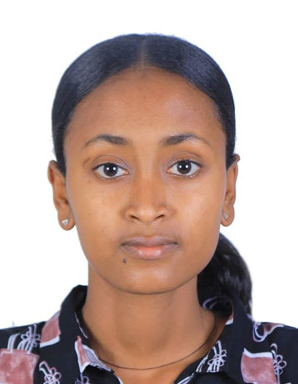

# Welcome to My Website

Hello! 
My name is Rshan Hluf. 
Welcome to my personal website.
{width=300}

## About Me

I am a Master of Data Science student at the University of British Columbia and a Mastercard Foundation Scholar, deeply interested in using data and AI to address the root causes of real-world community challenges. In addition to academics, I enjoy exploring new places, spending time in nature, and connecting with people from different backgrounds. 

I value community engagement and enjoy participating in activities that allow me to meet new people, learn from different perspectives, and contribute to meaningful causes.

I try to maintain a balance between my studies, personal growth, and the things I enjoy outside the classroom. Since moving to Vancouver, I have enjoyed discovering the city and its beautiful outdoor spaces.
## What I'm Learning

- Python
- R
- Git and GitHub
- Data visualization
- Quarto
